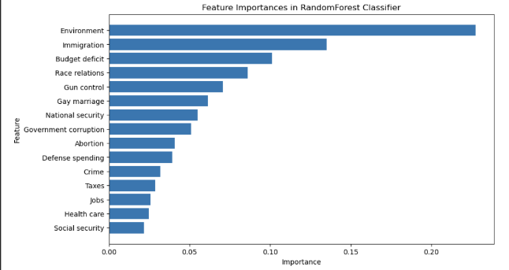
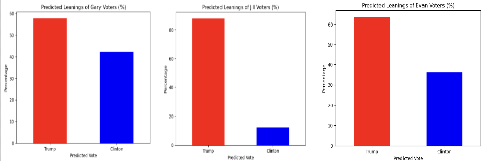
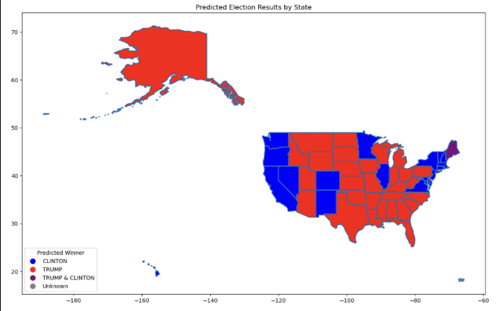
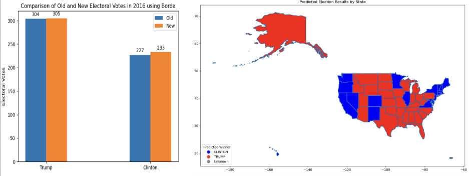
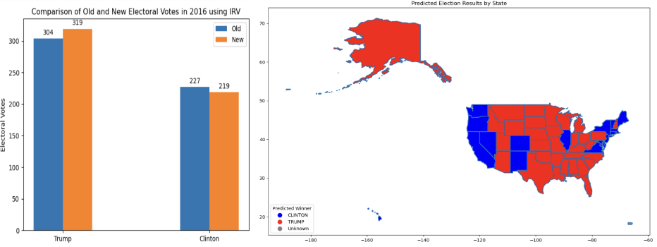
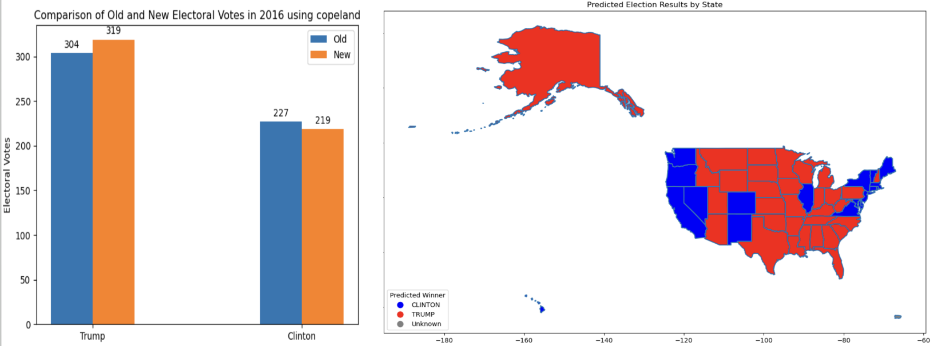

# Predicting Voter Preferences

## Libraries
* Python 3.4.1
* TensorFlow 2.15.1
* GeoPandas 20.22.7
* Pandas 1.16.0
* Matplotlib

## Datasets
* CCES 2016 voter survey
* Official Presidential Election data

## Tasks
* In 2016, which major party candidate (Trump or Clinton) would voters of third party candidates (Johnson, Stein, McMullin) likely choose as their second choice if Ranked Choice Voting was allowed?
* Rank all the features from most important to least important when it comes to determining whether third party candidates would put Trump or Clinton as their 2nd choice.
* Run a simulated presidential election with Borda, IRV, and Copeland using the new RCV ballots generated using official election data and second-choice predictions made using ML
* Compare predicted results with original 2016 election results

## Feature importances
* Trained a Random Forest Classifier model using Trump and Clinton data

## Second choice predictions for Third-party voters

## Simulate 2016 Presidential Elections
### Original

* Texas has 38 Electoral Votes.  1 was cast for John Kasich and 1 was cast for Ron Paul. 		
* Hawaii has 4 Electoral Votes and 1 was cast for Bernie Sanders. 
* Washington has 12 Electoral Votes.  3 were cast for Colin Powell and 1 was cast for Faith Spotted Eagle.   
* Maine has 4 electoral votes. 3 were cast for Clinton and 1 was cast for Trump.

### Borda Count

### Instant Run-off Voting

### Copeland

## Limitations
* Third party voter counts for states are approximations based on nationwide percentages since state-wise voter counts for each third party candidate are not provided.
* Results might change if more features are added to the ML model.
* A lot of the features are unanswered on the survey so training data is limited 
